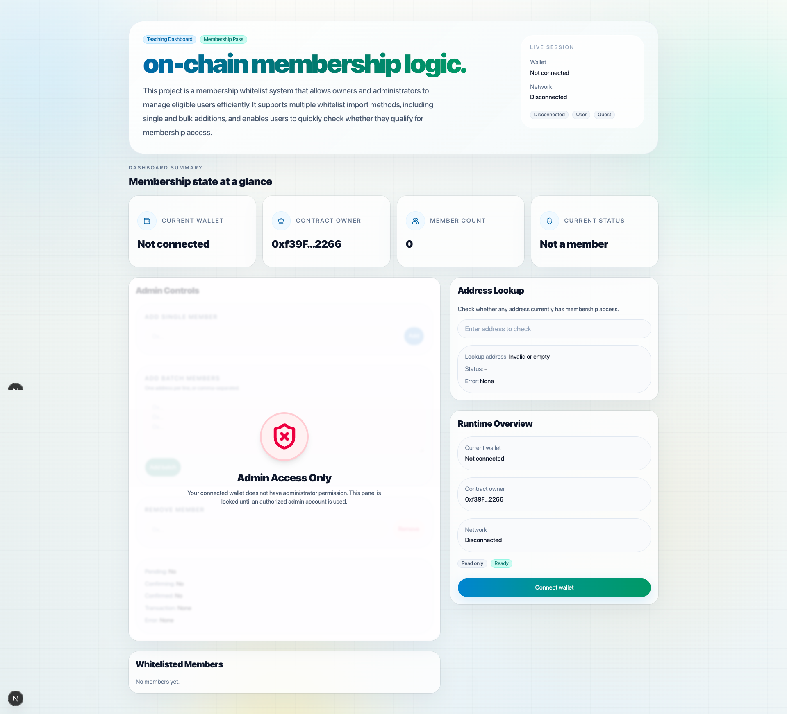
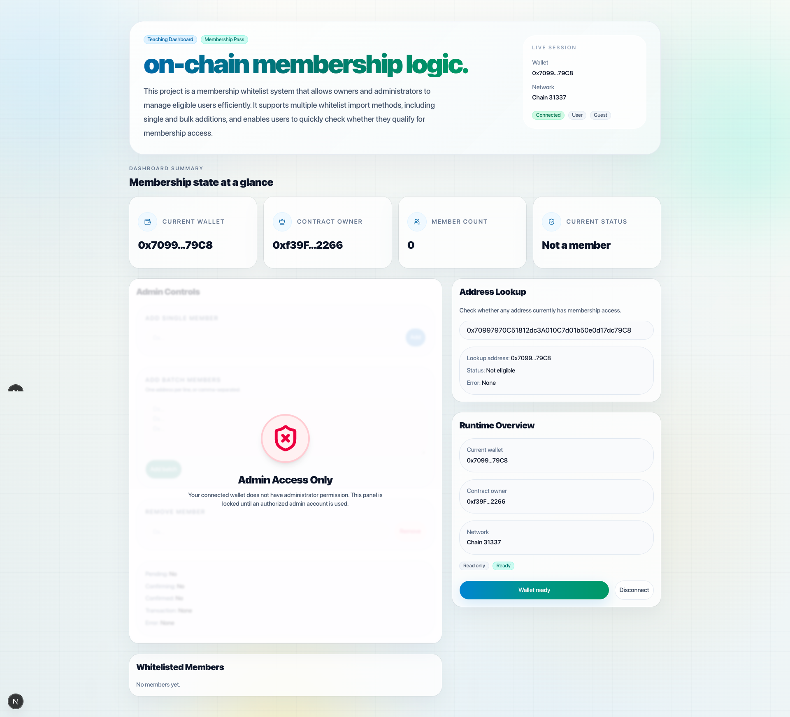
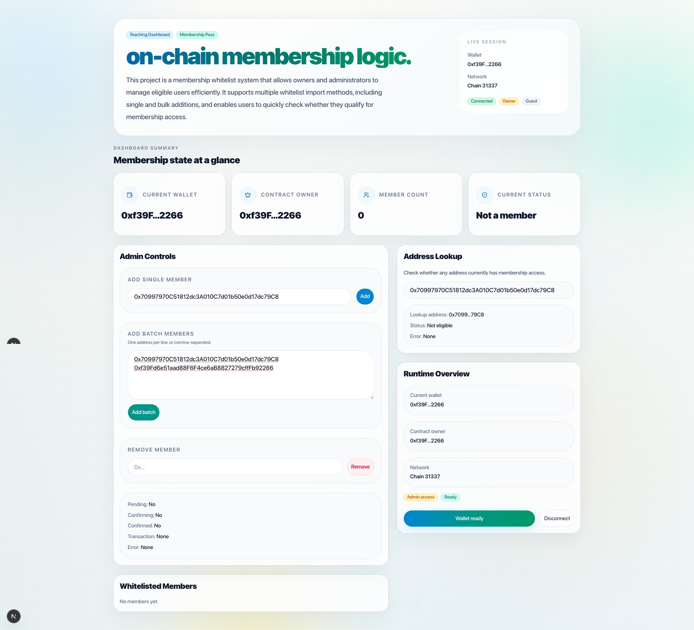
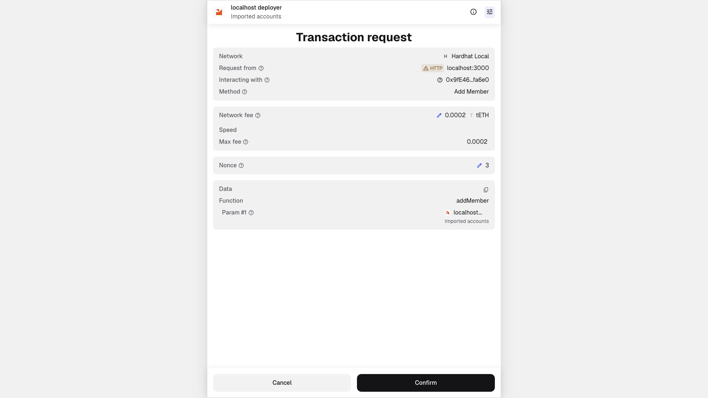
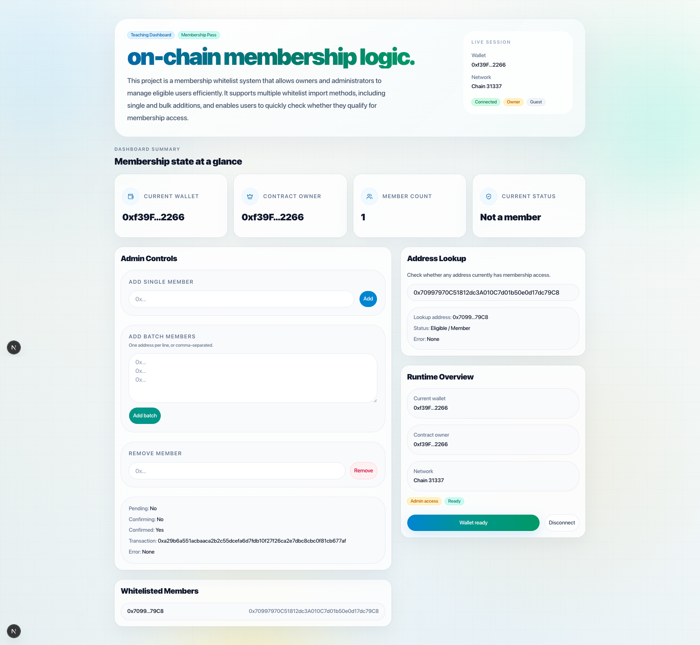

# Membership Pass DApp

An on-chain membership and whitelist management DApp built with Solidity, Hardhat, Next.js, Wagmi, and Viem.

This project demonstrates a simple but practical membership system on Ethereum-compatible networks. It allows the contract owner or authorized administrator to manage whitelist members on-chain, while regular users can connect their wallet and check whether they are eligible for membership access.

<p align="center">
  
  
  
</p>

<p align="center">
  
   
</p>
</p>

## Features

- Connect wallet and interact with the DApp
- Read on-chain membership state in real time
- Check whether a wallet address is eligible / whitelisted
- Owner or admin can add a single member
- Owner or admin can add members in batch
- Support multiple whitelist input methods
- Owner or admin can remove a member
- Display contract runtime state, current wallet, owner, and member count
- Disable admin operations for unauthorized users with clear UI feedback

## Tech Stack

### Smart Contract Layer

- Solidity
- Hardhat
- Hardhat Ignition
- TypeScript

### Frontend Layer

- Next.js
- React
- TypeScript
- Tailwind CSS

### Web3 Integration

- Wagmi
- Viem

## Project Architecture

This repository is organized as a small monorepo with a smart contract workspace and a frontend workspace.

```text
.
├── generated/              # exported contract metadata and frontend-consumable artifacts
├── hardhat/                # smart contract workspace
│   ├── contracts/          # Solidity contracts and interfaces
│   ├── scripts/            # deployment scripts
│   ├── ignition/           # Hardhat Ignition modules and deployment records
│   ├── deployments/        # deployment outputs
│   └── tools/export/       # artifact export tooling
├── web/                    # frontend workspace
│   ├── src/app/            # Next.js app entry
│   ├── src/components/     # UI and feature components
│   ├── src/hooks/          # business and view-model hooks
│   ├── src/lib/            # shared utilities, contracts, wagmi config
│   ├── src/providers/      # app providers
│   └── src/types/          # frontend types
└── README.md
```

## Frontend Design

The frontend follows a relatively clean separation of concerns:

- components/: presentational and feature UI components
- hooks/: state orchestration, wallet integration, lookup logic, admin actions
- lib/: reusable utilities, contract config, and Wagmi setup
- types/: domain-level TypeScript types

### Key frontend modules

- useWallet.ts
  Handles wallet connection, chain switching, and disconnect flow.
- useMembershipPassState.ts
  Reads contract state such as owner, member list, membership status, and counts.
- useMembershipPassAdminActions.ts
  Encapsulates admin write operations such as add single member, add batch members, and remove member.
- useMembershipPassLookup.ts
  Handles address-based eligibility lookup.
- useMembershipPassDashboard.ts
  Aggregates contract state, wallet state, admin actions, and derived view data.
- useMembershipPassDashboardController.ts
  Acts as a page-level controller hook that manages form state, derived lookup labels, and UI actions, keeping the page component lean and focused.

### UI composition

The membership dashboard is split into reusable panels:

- membership-pass-hero.tsx
- membership-pass-stat-card.tsx
- membership-pass-admin-panel.tsx
- membership-pass-lookup-panel.tsx
- membership-pass-runtime-panel.tsx
- membership-pass-members-panel.tsx

This makes the UI easier to maintain, test, and extend.

### Smart Contract Design

The smart contract layer is centered around MembershipPass.sol.

Core responsibilities include:

- storing the owner / privileged role
- managing membership eligibility on-chain
- adding members individually
- adding members in batch
- removing members
- exposing readable membership state to the frontend

### An interface file is also provided under:

hardhat/contracts/interfaces/IMembershipPass.sol

This keeps contract interactions more structured and easier to extend.

### How It Works

For regular users

1. Open the DApp
2. Connect a wallet
3. Check current membership status
4. Enter any address to verify whether it is eligible

For owner / admin

1. Connect the authorized wallet
2. Access the admin panel
3. Add a member with a single address
4. Add multiple members using batch input
5. Remove an existing member

If the connected wallet is not authorized, the admin panel is visually locked and all admin operations are disabled.

## Getting Started

1. Clone the repository

```
git clone https://github.com/Maimai10808/membership-pass-dapp.git
cd membership-pass-dapp
```

2. Install dependencies

Install root dependencies if needed:

```
npm install
```

Install dependencies for the smart contract workspace:

```
cd hardhat
npm install
```

Install dependencies for the frontend workspace:

```
cd ../web
npm install
```

3. Start a local blockchain

In the hardhat directory:

```
npx hardhat node
```

4. Deploy the MembershipPass contract

In another terminal, still inside hardhat:

```
IGNITION_FRESH=1 npx hardhat run scripts/deploy-membership-pass.ts --network localhost
```

If you are using Hardhat Ignition instead, run the corresponding deployment flow configured in the project.

5. Export contract data to the frontend

This project includes generated contract artifacts under:

```
generated/
```

Make sure the frontend is pointing to the latest deployed contract address and ABI.

If your workflow uses the export tool in hardhat/tools/export, run that export step after deployment so that generated/contracts.ts and related metadata stay synchronized.

6. Configure frontend environment

Inside web/.env.local, configure the required environment variables for your local or test deployment.

## Typical setup may include items such as:

- RPC URL
- target chain configuration
- deployed contract address

Adjust the actual values according to your environment and wagmi setup.

7. Start the frontend

Inside web:

```
npm run dev
```

Then open the local Next.js URL in your browser.

## Typical Development Workflow

### Contract-side

- update Solidity contract in hardhat/contracts
- compile and test with Hardhat
- deploy to local/test network
- export ABI and deployment metadata

### Frontend-side

- update Wagmi / contract config
- build or refine hooks
- compose UI panels
- verify read/write flows with connected wallet

### Example Use Cases

- whitelist gating for early product access
- on-chain membership eligibility checks
- admin-controlled allowlists
- demo project for learning full-stack Web3 development
- starter architecture for more advanced access-control DApps

## Why This Project

This project is intended as a practical DApp demo that combines:

- smart contract design
- deployment workflow
- frontend wallet integration
- on-chain reads and writes
- role-based UI behavior
- reusable React component structure

It is simple enough to understand quickly, but still structured enough to reflect a more production-oriented development style.

## Future Improvements

Potential next steps for this project include:

- role-based access control beyond owner-only logic
- event indexing and activity history
- pagination for large member lists
- CSV upload for batch import
- improved transaction feedback and notifications
- test coverage for contract and frontend flows
- support for multi-network deployments
- admin audit logs and analytics

## Project Structure Reference

```
hardhat/contracts/
MembershipPass.sol
interfaces/IMembershipPass.sol
```

```
web/src/components/membership-pass/
membership-pass-dashboard.tsx
membership-pass-admin-panel.tsx
membership-pass-lookup-panel.tsx
membership-pass-runtime-panel.tsx
membership-pass-members-panel.tsx
membership-pass-hero.tsx
membership-pass-stat-card.tsx
membership-pass-shell.tsx
```

```
web/src/hooks/
useWallet.ts
useMembershipPassState.ts
useMembershipPassAdminActions.ts
useMembershipPassLookup.ts
useMembershipPassDashboard.ts
useMembershipPassDashboardController.ts
```

```
web/src/lib/
contracts.ts
wagmi.ts
utils.ts
```

## License

MIT
